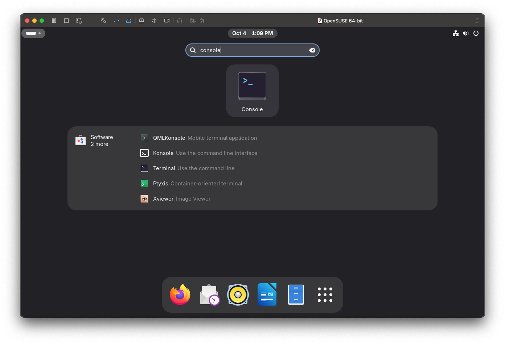

# Ch1. 安裝 opensuse

## 1-1. SUSE 簡介

### 1-1-1. SUSE 歷史

SUSE (Software und System-Entwicklung) 是最早的商業 Linux 發行版之一，起源於德國，在歐洲和企業級市場擁有深厚的影響力。

1. 早期成立與德語市場的開拓 (1992 - 1990 年代末)

   - 1992 年： SUSE 由 Roland Dyroff、Thomas Fehr、Burchard Steinbild 和 Hubert Mantel 在德國紐倫堡成立。最初，SUSE 是一家 UNIX 顧問公司，提供軟體服務並為德語市場銷售 UNIX 工具和發行版 (如 Slackware 和 S.u.S.E. Linux 0.98，一個修改過的 SLS 版本)。
   - 1994 年： 發布了第一個完整的 SUSE Linux 發行版 (S.u.S.E. Linux 1.0)，這是一個基於 Slackware 且德語化的版本。這標誌著 SUSE 從販賣其他發行版轉向開發自己的發行版。
   - 1996 年： 發布了第一個完全獨立開發的 SUSE Linux 發行版 (S.u.S.E. Linux 4.2)。這個版本引入了著名的 YaST (Yet another Setup Tool)，這是一個強大且易於使用的系統管理工具，成為 SUSE 的標誌性特色。YaST 讓複雜的 Linux 系統設定變得更加簡單直觀。

2. 商業化與企業級市場的擴張 (2000 年代初期)

   進入 2000 年代，SUSE 開始更加注重企業級市場，提供商業支援和企業級解決方案。

   - 2000 年： SUSE 成為第一家在 IBM 大型主機上提供 Linux 支援的企業，顯示其在企業級市場的雄心。
   - 2001 年： 將其企業產品線重新命名為 SUSE Linux Enterprise Server (SLES)，明確區分其針對伺服器和企業客戶的版本。SLES 以其穩定性、可靠性、長期支援和對各種硬體架構的良好兼容性而聞名。

3. 所有權的變遷與持續發展 (2000 年代中期 - 至今)

   SUSE 的歷史充滿了所有權的變動，但其對 Linux 和開源的承諾始終未變。

   - 2003 年： 被美國軟體巨頭 Novell 收購。這次收購為 SUSE 帶來了更多資源和市場機會，但也引起了開源社群的一些關注。
   - 2005 年： Novell 為了促進社群參與，推出了 openSUSE 計畫，將 SUSE Linux 的開發過程透明化並向社群開放，類似於 Red Hat 與 Fedora 的關係。openSUSE Leap 是一個基於 SLES 程式碼的穩定發行版，而 openSUSE Tumbleweed 則是一個滾動發行版，提供最新的軟體。
   - 2011 年： Novell 及其資產（包括 SUSE）被 Attachmate Group 收購。在此期間，SUSE 作為一個獨立的業務部門繼續運營。
   - 2014 年： Attachmate Group 被英國軟體公司 Micro Focus 收購。SUSE 再次成為 Micro Focus 旗下的一個業務部門。
   - 2018 年： SUSE 被投資公司 EQT Partners 收購，成為一家完全獨立的軟體公司。這為 SUSE 帶來了更大的自主權，使其能夠更專注於其核心業務和開源創新。
   - 2021 年： SUSE 成功在法蘭克福證券交易所上市，證明了其作為獨立開源公司在市場上的地位和價值。
   - 2025 年： YaST 開始被取代，安裝程式改為 Agama，系統管理改為 Cockpit，軟體管理改為 Myrlyn，以適應現代 IT 環境。

### 1-1-2. SUSE 版本

SUSE 主要提供兩個產品線：SUSE Linux Enterprise (SLE) 和 openSUSE。

- **SUSE Linux Enterprise (SLE)**:

  - **SLES (SUSE Linux Enterprise Server)**: 針對企業伺服器環境，提供長期支援和認證。
  - **SLED (SUSE Linux Enterprise Desktop)**: 針對企業桌面環境。
  - SLE 的主要版本通常每三到四年發布一次，服務包 (Service Packs) 大約每 12 個月發布一次。

- **openSUSE**:
  - **Leap**: 一個穩定的版本，其核心與 SLES 共享。版本發布週期較長，適合尋求穩定性的使用者。
  - **Tumbleweed**: 一個滾動發行版，持續提供最新的軟體包。適合希望體驗最新功能的開發者和進階使用者。

1. **SUSE Linux Enterprise Server (SLES)**

SLES 是 SUSE 公司推出的商業級、企業導向的 Linux 發行版。專為關鍵任務工作負載、伺服器、大型主機、雲端運算以及 SAP 解決方案而設計。其極致的穩定性、嚴格的測試流程和專業的長期支援而聞名，需要付費訂閱才能獲得完整的服務和更新。

- 企業級穩定性： 經過 SUSE 嚴格的品質保證流程，極為可靠，適合生產環境。
- 長期支援 (LTS)： 每個主要版本提供長達 13 年或更長的支援（包含基本和擴展支援），確保企業投資的持續性。
- 專業支援： 提供 24/7 全天候技術支援，對於運行關鍵業務的企業至關重要。
- SAP 完美整合： 被視為運行 SAP HANA 和 S/4HANA 解決方案的首選或推薦操作系統。
- 模組化： SLES 採用模組化設計，可根據需求選擇性安裝桌面、開發工具等模組。

2. **openSUSE Leap**

Leap 是 openSUSE 社群發行版中的固定週期發行版，與 SLES 共享核心程式碼基礎（源碼）。將 SLES 的企業級核心與 openSUSE 社群提供的較新應用程式和桌面環境相結合。提供了接近企業級的穩定性，同時也擁有更現代的桌面體驗。

- 穩定性： 由於其核心與 SLES 相同，Leap 是最穩定的社群發行版之一，非常適合一般使用者和伺服器。
- 企業級基礎： 繼承了 SLES 的高度測試和品質保證，提供穩固的操作系統平台。

3. **openSUSE Tumbleweed**

Tumbleweed 是 openSUSE 社群發行版中的滾動更新。基於 openSUSE 的主開發倉庫 Factory，不斷接收最新的軟體套件。目標是為用戶提供最新、最前沿的 Linux 內核、桌面環境和應用程式。作為滾動發行版，沒有固定版本號，沒固定版本號，而是每天或每週發布一個快照，用戶只需持續更新，系統永遠是最新狀態。

- 最新軟體： 始終擁有最新的 Linux 核心、驅動程式、桌面環境 (如 KDE Plasma/GNOME) 和開發工具。
- 持續更新： 無需進行大規模版本升級（例如從 Leap 15 升級到 Leap 16），節省時間和精力。
- 測試發行： Tumbleweed 的獨特優勢在於其更新在發布前會通過 openQA 進行嚴格的自動化測試，這使得它的穩定性遠高於一般未經測試的滾動發行版。
- 適合開發： 適合需要最新函式庫、最新編譯器或最新硬體支援的開發者和高級用戶。

### 練習
1.  要為公司的關鍵任務網頁伺服器選擇一個操作系統，會選擇 SLES、Leap 還是 Tumbleweed？請說明理由。
2.  軟體開發者，希望總能使用最新的程式庫和工具，會選擇哪個版本？為什麼？
3.  剛接觸 Linux 的家庭用戶，希望系統穩定且易於維護，Leap 和 Tumbleweed 哪個更適合？

---

## 1-2. 下載 openSUSE

首先，從官方網站下載 openSUSE 最新的安裝映像檔。

[openSUSE Leap 16.0](https://get.opensuse.org/leap/16.0/)

### 練習
1.  請前往 openSUSE 官方下載頁面，找出 "Offline Image" 的完整檔案名稱。

---

## 1-3. 設定 VMware Workstation / Fusion

在安裝 openSUSE 之前，需要先設定一個虛擬機。以下是在 VMware Workstation 或 Fusion 中設定的步驟。

**openSUSE Leap 16 最低系統需求:**

- **CPU**: x86-64-v2 相容 CPU (約 2008 年或之後)
- **RAM**: 2 GB 或以上
- **硬碟**: 40 GB

---

#### 步驟 1: 選擇安裝方式


- **描述**: 啟動 VMware Fusion，您會看到 "Select the Installation Method" (選擇安裝方式) 的畫面。
- **操作**: 選擇 "Create a custom virtual machine" (建立自訂虛擬機)，然後點擊 "Continue" (繼續)。

---

#### 步驟 2: 選擇作業系統


- **描述**: 在 "Choose Operating System" (選擇作業系統) 畫面中，您需要指定要安裝的作業系統類型。
- **操作**:
  1. 在左側列表中選擇 "Linux"。
  2. 在右側列表中選擇 "OpenSUSE 64-bit"。
  3. 點擊 "Continue" (繼續)。

---

#### 步驟 3: 選擇虛擬磁碟


- **描述**: 此步驟讓您選擇要使用的虛擬磁碟。
- **操作**: 選擇 "Create a new virtual disk" (建立新的虛擬磁碟)，然後點擊 "Continue" (繼續)。

---

#### 步驟 4: 完成虛擬機設定


- **描述**: 這是虛擬機設定的最後一步，顯示了虛擬機摘要資訊。
- **操作**:
  1. 點擊 "Customize Settings" (自訂設定) 來調整硬體配置。
  2. 系統會提示您儲存虛擬機，您可以為其命名 (例如 "openSUSE 16")。

---

#### 步驟 5: 調整硬體設定


- **描述**: 進入虛擬機的設定畫面後，您可以調整 CPU、記憶體、硬碟大小等。
- **操作**:
  - **處理器與記憶體 (Processors & Memory)**: 建議至少設定 2 個 CPU 核心和 4 GB 記憶體。
  - **硬碟 (Hard Disk)**: 點擊進入硬碟設定。

---

#### 步驟 6: 設定硬碟大小


- **描述**: 根據 openSUSE 的建議，設定硬碟大小。
- **操作**: 將硬碟大小調整為至少 40 GB (圖中為 50 GB)，然後點擊 "Apply" (套用)。

---

#### 步驟 7: 掛載安裝映像檔


- **描述**: 將先前下載的 openSUSE 安裝映像檔 (ISO) 掛載到虛擬機的 CD/DVD 光碟機。
- **操作**:
  1. 在設定中選擇 "CD/DVD (IDE)"。
  2. 勾選 "Connect CD/DVD Drive" (連接 CD/DVD 光碟機)。
  3. 選擇您下載的 `openSUSE-Leap-16.0-offline-x86_64.iso` 檔案。

### 練習
1.  請根據本章節的教學，在 VMware 中建立一個新的虛擬機，命名為 `my-opensuse-test`，並將其記憶體設定為 4GB，硬碟設定為 50GB。

---

## 1-4. 安裝 openSUSE

設定好虛擬機後，啟動虛擬機即可開始安裝 openSUSE。

---

#### 步驟 1: 啟動安裝程序


- **描述**: 從 ISO 開機後，會看到 openSUSE 的開機選單。
- **操作**: 使用方向鍵選擇 "Install Leap 16.0 (x86_64)"，然後按下 Enter。

---

#### 步驟 2: 選擇產品


- **描述**: 安裝程式會讓您選擇要安裝的產品。
- **操作**: 選擇 "Leap 16.0"，然後點擊 "Select"。

---

#### 步驟 3: 安裝總覽


- **描述**: 這是安裝設定的總覽頁面，您可以在此檢視和修改各項設定。
- **主要設定項目**:
  - **Localization (本地化)**: 語言、鍵盤、時區。
  - **Network (網路)**: 網路連線設定。
  - **Storage (儲存)**: 磁碟分割。
  - **Software (軟體)**: 選擇要安裝的軟體包。
  - **Authentication (認證)**: 設定使用者帳號和密碼。

---

#### 步驟 4: 本地化設定


- **描述**: 設定系統的語言、鍵盤佈局和時區。
- **操作**:
  - **Language**: 預設為 "English (United States)"。
  - **Keyboard**: 預設為 "English (US)"。
  - **Time zone**: 預設為 "Europe/Berlin"。您可以點擊 "Change" 來選擇您所在的時區。

---

#### 步驟 5: 網路設定


- **描述**: 檢視網路設定。在虛擬機中，通常使用 NAT 模式並透過 DHCP 自動取得 IP 位址，因此使用預設值即可。
- **注意**: 在實體機或特定網路環境中，需要手動設定靜態 IP。

---

#### 步驟 6: 儲存設定 (磁碟分割)


- **描述**: 這是磁碟分割的設定頁面。對於測試環境，使用預設的分割方案即可。
- **預設設定**:
  - **檔案系統**: 預設使用 Btrfs。如果需要，可變更為 XFS 或 ext4。
  - **分割區**: 預設會建立根目錄 (/) 和交換空間 (swap)。在正式環境中，通常建議將 `/home` 目錄獨立分割出來。

---

#### 步驟 7: 軟體選擇


- **描述**: 選擇想要安裝的桌面環境和軟體。
- **操作**:
  - **Graphical Environments**: 勾選偏好的桌面環境，例如 "GNOME Desktop Environment"。
  - **Base Technologies**: 根據需求選擇，例如 "SELinux Support"。
  - 選擇完畢後，點擊 "Close"。

---

#### 步驟 8: 建立使用者


- **描述**: 設定系統管理員 (root) 和一般使用者的帳號密碼。
- **操作**:
  1. 點擊 "Define a user now" 建立一個新使用者。
  2. 輸入 "Full name" (全名) 和 "Username" (使用者名稱)。
  3. 設定密碼並確認。
  4. 點擊 "Accept"。

---

#### 步驟 9: 確認使用者設定


- **描述**: 檢視建立的使用者資訊。
- **注意**: 需要設定 root 使用者的密碼。點擊 "Root user" 下方的 "Edit" 進行設定。

---

#### 步驟 10: 開始安裝


- **描述**: 所有設定完成後，回到總覽頁面，點擊右上角的 "Install" 按鈕。
- **確認**: 系統會彈出一個確認視窗，再次點擊 "Install" 開始安裝。

---

#### 步驟 11: 安裝過程


- **描述**: 安裝程式正在將系統檔案複製到硬碟並進行設定。請耐心等候。

---

#### 步驟 12: 安裝完成


- **描述**: 安裝完成後，系統會提示重新啟動。
- **操作**: 點擊 "Reboot" 重新啟動電腦。

### 練習
1.  在安裝 openSUSE 的過程中，「儲存」設定步驟中預設使用 Btrfs 檔案系統。請描述如果要將根目錄 (/) 的檔案系統變更為 XFS，應該如何操作？
2.  在「軟體選擇」步驟中，除了 GNOME，openSUSE 還提供了哪些其他的圖形化桌面環境選項？（提示：回到軟體選擇的截圖中尋找答案）

---

## 1-5. 初次使用 openSUSE

---

#### 步驟 1: 登入系統


- **描述**: 重新啟動後，您會看到登入畫面。
- **操作**: 點擊使用者名稱，然後輸入密碼登入。

---

#### 步驟 2: 歡迎畫面


- **描述**: 首次登入後，會顯示 openSUSE 的歡迎畫面 "Ahoy, this is openSUSE"。
- **操作**: 可閱讀 "Read me" 或 "Documentation" 來進一步了解系統。點擊 "Close" 關閉歡迎視窗。

---

#### 步驟 3: 開啟終端機 (Terminal)

在 Linux 系統中，終端機 (Terminal) 是非常重要的工具，需要熟悉如何開啟和使用它。



- **操作**:
  1. 點擊左上角的 "Activities" (活動)。
  2. 在搜尋框中輸入 "console" 或 "terminal"。
  3. 點擊 "Console" 圖示來開啟終端機。


- **描述**: 這就是終端機視窗，在這裡輸入指令來操作系統。

---

#### 步驟 4: 關機

想關閉系統，可以在終端機中執行以下指令：

```bash
tux@suse16:~> sudo poweroff
```

- `sudo`: 以系統管理員權限執行指令。
- `poweroff`: 關閉電腦。

執行此指令後，系統會要求輸入使用者密碼，驗證成功後便會開始關機程序。

### 練習
1.  開啟終端機，並嘗試使用 `whoami` 指令，看看系統回傳了什麼。
2.  使用 `uname -r` 指令來查詢目前系統使用的 Linux 核心版本。

---

## 1-6. agama\*

Agama 的開發目標是為 SUSE 帶來一個現代化、具備高度自動化能力的安裝體驗。不僅是一個圖形化介面，更是一個以服務為基礎的安裝框架，使其非常適合雲端和企業部署。

#### Agama Password

在開機時，切換到其他TTY(Ctrl + Alt + F1), 看到 Agama 的登入資訊，包括 IP 位址和密碼。


#### Agama Web

另一台電腦的瀏覽器中輸入該 IP 位址，來遠端進行安裝。這對於大量部署或無周邊設備 (headless) 的伺服器安裝非常有用。


### 練習
1.  用自己的話解釋，相較於傳統的圖形介面安裝程式，Agama 網頁式安裝程式對於管理多台伺服器的系統管理員來說，最大的好處是什麼？

---

## 1-7. 總結

本章節介紹了 openSUSE 的歷史與版本，並學習了如何從無到有，在 VMware 環境中安裝 openSUSE Leap 16.0。從建立虛擬機、設定硬體、掛載 ISO 映像檔，到完成系統安裝及初次使用的基本操作，一步步完成了整個過程，包括地區、網路、磁碟分割、軟體選擇和使用者建立。也學習了如何初次登入系統、開啟終端機和執行關機指令。最後，也簡單介紹了新一代的網頁式安裝程式 Agama。能順利開始 openSUSE 之旅。
