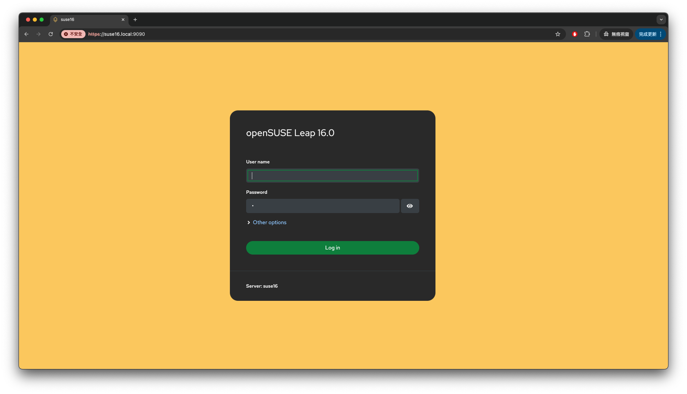
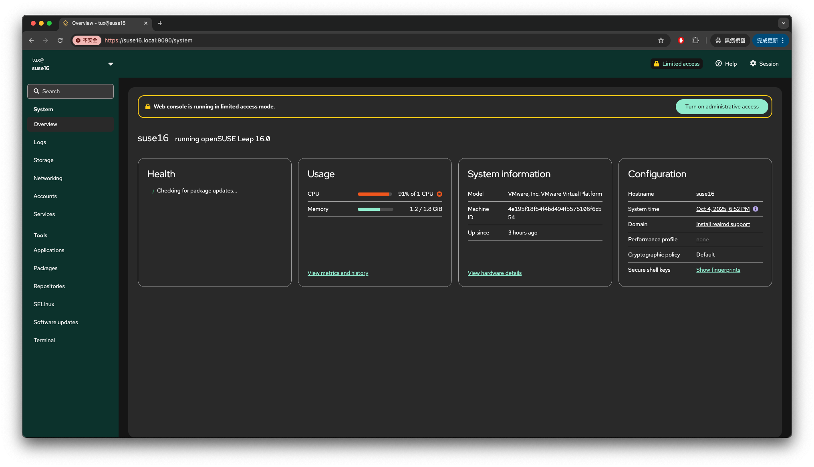

# ch2. Linux 指令與管理

介紹在 openSUSE 環境中常用的 Linux 指令，涵蓋系統管理、檔案操作、網路設定等多個方面。

## 2-1. 基本指令

### 2-1-1. 系統關機、重啟

管理系統的運行狀態是基礎且重要的操作。

- **`uptime`**: 顯示系統已經運行的時間、登入的使用者數量，以及系統的平均負載。

  ```bash
  tux@suse16:~> uptime
  10:20:30 up 2 days,  1:15,  1 user,  load average: 0.00, 0.01, 0.05
  ```

- **`shutdown`**: 關閉系統。可以指定關機時間。需要 `root` 權限。

  - **立即關機**:
    ```bash
    tux@suse16:~> sudo shutdown -h now
    ```
  - **10 分鐘後關機**:
    ```bash
    tux@suse16:~> sudo shutdown -h +10 "系統將在10分鐘後關機"
    ```
  - **在指定時間關機 (晚上 11 點)**:
    ```bash
    tux@suse16:~> sudo shutdown -h 23:00
    ```
  - **取消關機**:
    ```bash
    tux@suse16:~> sudo shutdown -c
    ```
  - **立即重新啟動**:
    ```bash
    tux@suse16:~> sudo shutdown -r now
    ```

- **`poweroff`**: 立即關閉系統，相當於 `shutdown -h now`。需要 `root` 權限。

  ```bash
  tux@suse16:~> sudo poweroff
  ```

- **`reboot`**: 重新啟動系統。相當於 `shutdown -r now`需要 `root` 權限。
  ```bash
  tux@suse16:~> sudo reboot
  ```

### 2-1-2. 檔案與目錄管理

這些指令是進行檔案系統導覽和操作的基礎。

- **`pwd` (Print Working Directory)**: 顯示目前所在的目錄路徑。

  ```bash
  tux@suse16:~> pwd
  /home/tux
  ```

- **`ls` (List)**: 列出目錄中的檔案和子目錄。

  - **列出目前目錄內容**:
    ```bash
    tux@suse16:~> ls
    Desktop  Documents  Downloads  Music
    ```
  - **列出詳細資訊 (`-l`)**:
    ```bash
    tux@suse16:~> ls -l
    total 16
    drwxr-xr-x 2 tux users 4096 Oct  7 10:00 Desktop
    drwxr-xr-x 2 tux users 4096 Oct  7 10:00 Documents
    ```
  - **列出所有檔案，包括隱藏檔 (`-a`)**:
    ```bash
    tux@suse16:~> ls -a
    .  ..  .bashrc  .profile  Desktop
    ```

- **`cd` (Change Directory)**: 切換目錄。

  - **切換到 `/etc` 目錄**:
    ```bash
    tux@suse16:~> cd /etc
    ```
  - **回到家目錄**:

    ```bash
    # 不加任何參數
    tux@suse16:/etc> cd
    tux@suse16:~>

    # 或者使用波浪號 ~
    tux@suse16:/etc> cd ~
    tux@suse16:~>
    ```

  - **回到上一層目錄**:
    ```bash
    tux@suse16:/etc/sysconfig> cd ..
    tux@suse16:/etc>
    ```
  - **回到前一個工作目錄**:
    ```bash
    tux@suse16:~> cd /etc/sysconfig
    tux@suse16:/etc/sysconfig> cd -
    tux@suse16:~>
    ```

- **`mkdir` (Make Directory)**: 建立新目錄。

  - **建立一個新目錄**:

  ```bash
  tux@suse16:~> mkdir my_project
  ```

  - **遞迴建立多層目錄 (`-p`)**: 可一次建立多層不存在的目錄。

  ```bash
  tux@suse16:~> mkdir -p project/src/components
  ```

- **`rmdir` (Remove Directory)**: 刪除空目錄。

  ```bash
  tux@suse16:~> rmdir my_project
  ```

- **`cp` (Copy)**: 複製檔案或目錄。

  - **複製檔案**:
    ```bash
    tux@suse16:~> cp source.txt destination.txt
    ```
  - **複製整個目錄 (`-r`)**:
    ```bash
    tux@suse16:~> cp -r my_project project_backup
    ```
  - **複製並保留檔案屬性 (`-p`)**: 保留檔案的權限、擁有者和時間戳。
    ```bash
    tux@suse16:~> cp -p file1.txt file2.txt
    ```

- **`mv` (Move)**: 移動或重新命名檔案或目錄。

  - **重新命名檔案**:
    ```bash
    tux@suse16:~> mv old_name.txt new_name.txt
    ```
  - **移動檔案到不同目錄**:
    ```bash
    tux@suse16:~> mv new_name.txt my_project/
    ```

- **`rm` (Remove)**: 刪除檔案或目錄。
  - **刪除檔案**:
    ```bash
    tux@suse16:~> rm old_file.txt
    ```
  - **刪除目錄及其所有內容 (`-r`)**:
    ```bash
    tux@suse16:~> rm -r project_backup
    ```
  - **強制刪除，無提示 (`-f`)**:
    ```bash
    tux@suse16:~> rm -rf project_backup
    ```
  - **刪除前進行確認 (`-i`)**: 在刪除前提示確認。
    ```bash
    tux@suse16:~> rm -i file_to_delete.txt
    ```

### 2-1-3. 檔案與權限

Linux 透過檔案權限來控制對檔案和目錄的存取。

#### 存取控制模型

- **DAC (Discretionary Access Control)**: 自主存取控制。檔案的擁有者可以決定誰可以存取該檔案，並設定相應的權限。這是 Linux 預設的權限模型。
- **MAC (Mandatory Access Control)**: 強制存取控制。系統管理員定義全域的安全策略，強制應用於所有使用者和檔案，使用者無法覆寫這些策略。例如 SELinux 或 AppArmor。

本節專注於 DAC 模型。

#### 權限詳解

使用 `ls -l` 可以看到檔案的權限資訊：

```
-rw-r--r-- 1 tux users 1024 Oct  7 10:30 myfile.txt
```

- **第一個字元**: 表示檔案類型 (`-` 為普通檔案, `d` 為目錄, `l` 為符號連結)。
- **接下來九個字元**: 分為三組，代表三種身份的權限：
  1.  **擁有者 (User)**: `rw-` (讀、寫)
  2.  **所屬群組 (Group)**: `r--` (唯讀)
  3.  **其他人 (Others)**: `r--` (唯讀)
- **權限類型**:

  - `r` (Read): 讀取權限。
  - `w` (Write): 寫入/修改權限。
  - `x` (Execute): 執行權限。

- **`chmod` (Change Mode)**: 修改檔案或目錄的權限。

  - **符號模式**:

    ```bash
    # 為擁有者增加執行權限
    tux@suse16:~> chmod u+x script.sh

    # 移除其他人的寫入和執行權限
    tux@suse16:~> chmod o-wx data

    # 設定所有人的權限為讀取
    tux@suse16:~> chmod a=r myfile.txt
    ```

  - **數字模式**: `r=4`, `w=2`, `x=1`

    - `rwx` = 4 + 2 + 1 = 7
    - `rw-` = 4 + 2 + 0 = 6
    - `r-x` = 4 + 0 + 1 = 5

    ```bash
    # 設定權限為 rwxr-xr-x (755)
    tux@suse16:~> chmod 755 script.sh

    # 設定權限為 rw-rw-r-- (664)
    tux@suse16:~> chmod 664 config.yaml
    ```

- **`chown` (Change Owner)**: 變更檔案或目錄的擁有者和/或群組。

  - **變更擁有者**:
    ```bash
    tux@suse16:~> sudo chown newuser myfile.txt
    ```
  - **變更擁有者和群組**:
    ```bash
    tux@suse16:~> sudo chown newuser:newgroup myfile.txt
    ```
  - **遞迴變更目錄 (`-R`)**:
    ```bash
    tux@suse16:~> sudo chown -R newuser:newgroup /home/newuser/data
    ```

- **`stat`**: 顯示檔案或檔案系統的詳細狀態資訊，包括權限、大小、時間戳等。
  ```bash
  tux@suse16:~> stat script.sh
  File: script.sh
  Size: 1024       Blocks: 8          IO Block: 4096   regular file
  Device: 801h/2049d Inode: 123456      Links: 1
  Access: (0755/-rwxr-xr-x)  Uid: ( 1000/   tux)   Gid: (  100/ users)
  Access: 2025-10-07 15:00:00.000000000 +0800
  Modify: 2025-10-07 14:50:00.000000000 +0800
  Change: 2025-10-07 14:55:00.000000000 +0800
  ```

### 2-1-4. 文字處理

處理純文字檔案是 Linux 中的日常工作。

- **`cat` (Concatenate)**: 顯示檔案內容或串接檔案。

  ```bash
  tux@suse16:~> cat /etc/os-release
  ```

- **`less`**: 分頁顯示檔案內容，允許向前和向後捲動。按 `q` 退出。

  ```bash
  tux@suse16:~> less /var/log/messages
  ```

- **`grep`**: 在檔案中搜尋符合樣式的行。

  - **在檔案中搜尋 "error"**:
    ```bash
    tux@suse16:~> grep "error" /var/log/syslog
    ```
  - **遞迴搜尋目前目錄下的所有檔案 (`-r`)，並忽略大小寫 (`-i`)**:
    ```bash
    tux@suse16:~> grep -ri "database" .
    ```

- **`head`**: 顯示檔案的開頭幾行 (預設為 10 行)。

  ```bash
  tux@suse16:~> head /var/log/messages
  ```

- **`tail`**: 顯示檔案的結尾幾行 (預設為 10 行)。

  - **持續追蹤檔案更新 (`-f`)**:
    ```bash
    tux@suse16:~> tail -f /var/log/messages
    ```

- **`man` (Manual)**: 顯示指令的手冊頁。
  ```bash
  tux@suse16:~> man ls
  ```

### 練習

1.  建立一個名為 `practice` 的目錄。
2.  在 `practice` 目錄中，建立一個名為 `notes.txt` 的空檔案。
3.  將 `/etc/os-release` 的內容複製到 `notes.txt` 中。
4.  使用 `grep` 指令，從 `notes.txt` 中找出包含 "NAME" 的那一行。
5.  將 `notes.txt` 重新命名為 `system_info.txt`。
6.  將 `system_info.txt` 的權限設定為只有擁有者可以讀寫，其他人沒有任何權限。
7.  最後，刪除整個 `practice` 目錄。

---

## 2-2. 常用設定

### 2-2-1. 網路

- **`ip`**: 顯示和管理路由、網路設備、介面和通道。

  - **顯示所有網路介面的 IP 位址**:
    ```bash
    tux@suse16:~> ip addr
    ```
  - **顯示路由表**:
    ```bash
    tux@suse16:~> ip route
    ```

- **`nmtui` (NetworkManager Text User Interface)**: 一個基於文字的圖形介面，用於設定 NetworkManager。

  ```bash
  tux@suse16:~> sudo nmtui
  ```

- **`nmcli` (NetworkManager Command Line Interface)**: NetworkManager 的命令列工具。
  - **顯示所有網路連線**:
    ```bash
    tux@suse16:~> nmcli connection show
    ```
  - **顯示設備狀態**:
    ```bash
    tux@suse16:~> nmcli device status
    ```

### 2-2-2. 防火牆

openSUSE 預設使用 `firewalld` 作為防火牆管理工具。

- **`firewall-cmd`**: `firewalld` 的命令列介面。
  - **查看防火牆狀態**:
    ```bash
    tux@suse16:~> sudo firewall-cmd --state
    running
    ```
  - **重新載入防火牆規則 (使其永久規則生效)**:
    ```bash
    tux@suse16:~> sudo firewall-cmd --reload
    ```
  - **允許 HTTP 服務 (永久)**:
    ```bash
    tux@suse16:~> sudo firewall-cmd --add-service=http --permanent
    ```
  - **允許 8080 連接埠 (永久)**:
    ```bash
    tux@suse16:~> sudo firewall-cmd --add-port=8080/tcp --permanent
    ```
  - **列出所有允許的服務和連接埠**:
    ```bash
    tux@suse16:~> sudo firewall-cmd --list-all
    ```

### 2-2-3. 軟體

openSUSE 使用 `zypper` 作為其主要的套件管理工具。

- **`zypper`**:

  - **安裝套件**:
    ```bash
    tux@suse16:~> sudo zypper install nginx
    ```
  - **移除套件**:
    ```bash
    tux@suse16:~> sudo zypper remove nginx
    ```
  - **更新所有套件**:
    ```bash
    tux@suse16:~> sudo zypper up
    ```
  - **搜尋套件**:
    ```bash
    tux@suse16:~> zypper search python3
    ```
  - **顯示套件資訊**:
    ```bash
    tux@suse16:~> zypper info python3
    ```

- **`rpm` (RPM Package Manager)**: 用於管理 `.rpm` 套件的底層工具。
  - **查詢已安裝的 `openssh` 套件**:
    ```bash
    tux@suse16:~> rpm -q openssh
    ```
  - **列出某個套件安裝的檔案**:
    ```bash
    tux@suse16:~> rpm -ql openssh
    ```
  - **安裝本地的 .rpm 檔案**:
    ```bash
    tux@suse16:~> sudo rpm -ivh package-name.rpm
    ```

### 練習

1.  使用 `ip addr` 指令找出主要網路介面名稱 (通常是 `eth0` 或 `ens` 開頭)。
2.  使用 `zypper search` 指令搜尋一個套件 (例如 `htop`)。
3.  使用 `firewall-cmd` 開放一個 TCP 連接埠 `5000`，並讓設定永久生效。

---

## 2-3. 常用服務

### 2-3-1. ssh (Secure Shell)

SSH 允許安全地遠端登入和管理伺服器。

```bash
# 安裝 openssh 伺服器套件
tux@suse16:~> sudo zypper in openssh-server

# 檢查 sshd 服務狀態
tux@suse16:~> sudo systemctl status sshd.service

# 設定開機時自動啟動 sshd 服務
tux@suse16:~> sudo systemctl enable sshd.service

# 立即啟動 sshd 服務
tux@suse16:~> sudo systemctl start sshd.service

# 在防火牆中永久允許 ssh 服務
tux@suse16:~> sudo firewall-cmd --add-service=ssh --permanent

# 重新載入防火牆規則
tux@suse16:~> sudo firewall-cmd --reload
```

### 2-3-2. mdns (Multicast DNS)

mDNS 允許在區域網路中，使用 `.local` 的主機名稱 (例如 `suse16.local`)來存取其他主機，而不需要設定 DNS 伺服器。`avahi` 是 mDNS 的一個常見服務。

```bash
# 安裝 avahi 套件
tux@suse16:~> sudo zypper in avahi

# 檢查 avahi 服務狀態
tux@suse16:~> sudo systemctl status avahi-daemon.service

# 設定開機時自動啟動 avahi 服務
tux@suse16:~> sudo systemctl enable avahi-daemon.service

# 立即啟動 avahi 服務
tux@suse16:~> sudo systemctl start avahi-daemon.service

# 在防火牆中永久允許 mdns 服務
tux@suse16:~> sudo firewall-cmd --add-service=mdns --permanent

# 重新載入防火牆規則
tux@suse16:~> sudo firewall-cmd --reload
```

### 2-3-3. cockpit

Cockpit 是一個基於 Web 的伺服器管理介面。

```bash
# 安裝 cockpit
tux@suse16:~> sudo zypper in -t pattern cockpit

# 檢查 cockpit socket 狀態
tux@suse16:~> sudo systemctl status cockpit.socket

# 設定開機時自動啟動 cockpit
tux@suse16:~> sudo systemctl enable cockpit.socket

# 立即啟動 cockpit
tux@suse16:~> sudo systemctl start cockpit.socket

# 在防火牆中永久允許 cockpit 服務
tux@suse16:~> sudo firewall-cmd --add-service=cockpit --permanent

# 重新載入防火牆規則
tux@suse16:~> sudo firewall-cmd --reload

# 安裝額外的 cockpit 插件
tux@suse16:~> sudo zypper in cockpit-repos cockpit-packages
```

安裝完成後，透過瀏覽器訪問 `https://suse16.local:9090` 來使用 Cockpit。

#### 步驟 1: Cockpit 登入



- **描述**: 這是 openSUSE 的網頁管理介面 Cockpit 的登入頁面。瀏覽器網址為 https://suse16.local:9090。
- **操作**: 在 "User name" 欄位輸入使用者名稱，在 "Password" 欄位輸入密碼，然後點擊 "Log in" 按鈕登入。

#### 步驟 2: Cockpit 儀表板



- **描述**: 登入後，會看到 Cockpit 的系統總覽儀表板。此時畫面會提示 "Web console is running in limited access mode"
  (網頁主控台正在以受限模式執行)。儀表板上顯示了系統狀況、資源使用率、系統資訊和組態等區塊。
- **操作**: 點擊右上方的 "Turn on administrative access" 按鈕以啟用管理權限。左側的選單可用於導航至不同的管理頁面，例如 "Logs" (日誌)、"Storage" (儲存) 或 "Networking" (網路)。

### 練習

1.  請寫出一個指令，用來檢查 `sshd` 服務目前是否正在運行 (active)。
2.  如果無法透過 `ping my-suse.local`，應該檢查哪個服務是否已安裝並啟動？

---

## 2-4. 使用者與群組管理

### 2-4-1. 使用者 (User)

#### `useradd`

建立新使用者。

**範例：**

```bash
# 建立一個名為 bob 的使用者，並為其建立家目錄 (-m)
tux@suse16:~> sudo useradd -m bob
```

#### `userdel`

刪除使用者。

**範例：**

```bash
# 刪除 bob 使用者，並同時刪除其家目錄 (-r)
tux@suse16:~> sudo userdel -r bob
```

#### `usermod`

修改使用者屬性。

**範例：**

```bash
# 將 bob 加入到 wheel 群組 (-aG: a=append, G=groups)
tux@suse16:~> sudo usermod -aG wheel bob
```

#### `passwd`

設定或變更使用者密碼。

**範例：**

```bash
# 為 bob 設定密碼 (會提示輸入新密碼)
tux@suse16:~> sudo passwd bob
```

#### `/etc/passwd` 檔案

這個檔案儲存了系統上所有使用者的基本資訊，每一行代表一個使用者。格式如下：
`username:password:UID:GID:GECOS:home_directory:shell`

- `password`: 欄位通常是 `x`，表示加密後的密碼儲存在 `/etc/shadow`。
- `UID`: 使用者 ID。`0` 代表 `root`。
- `GID`: 使用者主要群組 ID。

### 2-4-2. 群組 (Group)

#### `groupadd`

建立新群組。

**範例：**

```bash
tux@suse16:~> sudo groupadd developers
```

#### `groupdel`

刪除群組。

**範例：**

```bash
tux@suse16:~> sudo groupdel developers
```

#### `/etc/group` 檔案

儲存群組資訊，格式如下：
`group_name:password:GID:user_list`

### 練習

1.  建立一個名為 `testuser` 的新使用者。
2.  為 `testuser` 設定一個密碼。
3.  建立一個名為 `testers` 的新群組。
4.  將 `testuser` 加入到 `testers` 群組中。

---

## 2-5. `su` & `sudo`

#### `su` (Switch User)

切換使用者身分。

**範例：**

```bash
# 切換到 root 使用者 (需要輸入 root 密碼)
tux@suse16:~> su -

# 切換到 bob 使用者
tux@suse16:~> su - bob
```

`su -` 中的 `-` 表示 "login"，它會載入目標使用者的環境變數和家目錄，是推薦的用法。

#### `sudo` (Superuser Do)

允許被授權的使用者以其他使用者 (通常是 `root`) 的身分來執行指令，而不需要知道目標使用者的密碼。使用者只需輸入自己的密碼即可。

**範例：**

```bash
# 以 root 身分執行 zypper update
tux@suse16:~> sudo zypper update
```

#### `/etc/sudoers` 檔案

這個檔案定義了誰可以使用 `sudo` 以及他們可以執行的指令。**絕對不要直接用 `vim` 編輯此檔案！** 應使用 `visudo` 指令，它會在儲存前檢查語法錯誤，防止你把自己鎖在系統之外。

**範例 (使用 `visudo` 開啟後):**

```
# 允許 wheel 群組中的所有成員以 root 身分執行任何指令
%wheel ALL=(ALL) ALL
```

#### su & sudo 使用時機

|      | 使用時機                                                       | 理由                                                                                                |
| ---- | -------------------------------------------------------------- | --------------------------------------------------------------------------------------------------- |
| su   | 極少數情況，需要進行一系列連貫、密集且多個指令的 root 任務時。 | 需長時間 root 環境，且是系統的唯一管理員或信任的資深管理員，並知道如何謹慎操作。 （不建議日常使用） |
| sudo | 日常管理，需要以 root 身份執行單一或一組指令時。               | 更安全，有記錄，不需要共用 root 密碼。這是現代 Linux 發行版推薦和標準的管理方式。                   |

### 練習

1.  請說明為什麼在多人管理的伺服器上，使用 `sudo` 通常比共用 `root` 帳號的密碼（透過 `su`）更安全？

---

## 2-6. 終端機多工器

當你透過 SSH 遠端工作時，如果網路斷線，正在執行的任務也會中斷。終端機多工器 (Terminal Multiplexer) 可以解決這個問題。

#### `screen`

一個老牌的終端機多工器。

**基本用法：**

1.  `screen`: 建立一個新的 screen session。
2.  在 session 中執行你的長時間任務。
3.  按 `Ctrl+A` 然後按 `d` 來 "detach" (分離) session，此時你可以安全地關閉終端機，任務會繼續在背景執行。
4.  `screen -ls`: 列出所有 session。
5.  `screen -r [session_id]`: "resume" (重新連接) 到指定的 session。

#### `tmux`

一個更現代、功能更豐富的終-端機多工器，支援分割視窗、多個標籤頁等。

**基本用法：**

1.  `tmux`: 建立一個新的 tmux session。
2.  按 `Ctrl+B` 然後按 `%` 來垂直分割視窗。
3.  按 `Ctrl+B` 然後按 `"` 來水平分割視窗。
4.  按 `Ctrl+B` 然後按 `d` 來分離 session。
5.  `tmux ls`: 列出所有 session。
6.  `tmux attach -t [session_id]`: 重新連接到指定的 session。

### 練習

1.  透過 SSH 遠端編譯一個大型專案，預計需要 2 小時。請描述你會如何使用 `tmux` 來確保即使筆電斷線，編譯過程也能繼續進行。

---

## 2-7. 其他

### 2-7-1. `vim`

`vim` 是一個功能強大但學習曲線陡峭的文字編輯器。它是 Linux 系統管理員必備的工具之一，因為它幾乎存在於所有 Linux 系統中。

**基本操作：**

1.  `vim filename`: 開啟或建立檔案。
2.  進入 `vim` 後是 **Normal Mode** (普通模式)。
3.  按 `i` 進入 **Insert Mode** (插入模式)，此時可以輸入文字。
4.  按 `Esc` 回到 **Normal Mode**。
5.  在 **Normal Mode** 下，輸入 `:` 進入 **Command-Line Mode** (指令列模式)。
    - `:w`: 儲存 (write)
    - `:q`: 離開 (quit)
    - `:wq`: 儲存並離開
    - `:q!`: 強制離開 (不儲存變更)

### 2-7-2. `ssh`

`ssh` 不僅是服務，也是一個客戶端指令，用於連線到遠端的 SSH 伺服器。

**範例：**

```bash
# 以 tux 使用者的身分，連線到 192.168.1.100 主機
tux@suse16:~> ssh tux@192.168.1.100

# 如果遠端使用者名稱和本地相同，可以省略
tux@suse16:~> ssh 192.168.1.100
```

#### `~/.ssh/config` 檔案

常用的遠端主機設定別名和參數，簡化連線過程。

**範例 (`~/.ssh/config`):**

```conf
Host webserver
    HostName 192.168.1.100
    User admin
    Port 2222

Host dbsrv
    HostName db.example.com
    User dba
```

設定後，就可以用 `ssh webserver` 或 `ssh dbsrv` 來快速連線。

```bash
suse16:~ $ ssh webserver
suse16:~ $ ssh dbsrv
```

### 練習

1.  請寫下使用 `vim` 開啟檔案 `/tmp/test.txt`，輸入 "Hello World"，然後儲存並離開的完整按鍵順序。
2.  在家目錄下，設定一個 `~/.ssh/config` 檔案，可使用 `ssh dev` 指令來連線到 IP 位址為 `192.168.10.50`、使用者為 `developer` 的主機。

---

## 2-8. 總結

本章節詳細介紹了在 openSUSE 環境下進行日常管理所需的核心 Linux 指令。從最基本的系統開關機、檔案目錄操作，到重要的檔案權限管理，學習了 `ls`, `cd`, `cp`, `mv`, `rm`, `chmod`, `chown` 等基礎工具。接著，我們探討了系統設定的關鍵領域，包括使用 `ip`, `nmtui` 管理網路；透過 `firewall-cmd` 設定防火牆規則；以及利用 `zypper` 和 `rpm` 進行軟體套件的安裝、更新與移除。也學習如何啟用和管理 `sshd`, `avahi` (mDNS), `cockpit` 等常用服務，讓系統更容易從遠端存取和管理。此外，還涵蓋了使用者與群組的建立和修改，以及 `su` 和 `sudo` 在權限提升上的區別與正確使用時機。最後，介紹了 `vim`, `tmux` 和 `ssh` 客戶端等強大的終端機工具，它們是提升 Linux 環境工作效率的關鍵。透過本章的學習，已經具備了在 openSUSE 上進行基本系統管理和操作的能力。
