# Ch8. Linux 圖形介面與應用程式

本章介紹構成現代 Linux 圖形使用者介面 (GUI) 的核心元件。從底層的顯示伺服器協定 (X11 與 Wayland) 開始，逐步向上探索使用者直接互動的桌面環境 (DE) 與負責登入管理的顯示管理器 (DM)，最後再介紹在 openSUSE 上常見且功能強大的各類圖形應用程式。

## 8-1. Linux UI Stack / 圖形介面堆疊

一個完整的 Linux 圖形介面是由多個層次的軟體堆疊而成，每一層都扮演著不可或缺的角色，協同運作以提供流暢的使用者體驗。

```text
+-------------------------+
|     應用程式 (App)      |  (使用者互動的軟體，如 Firefox, LibreOffice)
| (Firefox, GIMP, ...)    |
+-------------------------+
|   桌面環境 (DE)         |  (提供視窗、選單、面板等完整操作介面)
| (GNOME, KDE, ...)       |
+-------------------------+
|   顯示管理器 (DM)       |  (提供圖形化登入介面，並啟動桌面環境)
| (GDM, SDDM, ...)        |
+-------------------------+
| 顯示伺服器 (Display Server) |  (處理繪圖指令與輸入/輸出事件)
| (X11, Wayland)          |
+-------------------------+
|     Linux 核心 (Kernel)   |  (管理硬體資源，提供系統底層服務)
+-------------------------+
|        硬體 (Hardware)    |  (實體電腦硬體，如 CPU, GPU, 螢幕)
+-------------------------+
```

### 8-1-1. 顯示伺服器：X11 vs. Wayland

顯示伺服器是圖形介面的基石，其主要工作是協調來自應用程式的繪圖請求，將它們呈現在螢幕上，同時也負責處理來自鍵盤、滑鼠等輸入裝置的事件。

- **X11 (X Window System)**:

  - **歷史與架構**: X11 誕生於 1980 年代，是一個歷史悠久且極其成熟的顯示協定。它採用 **客戶端/伺服器 (Client/Server)** 架構，即使在本地端，應用程式 (Client) 也是透過網路協定與 X Server 進行通訊。這種設計使其天生就具備網路透明性，可以輕易地透過 SSH 在遠端伺服器上執行圖形應用程式，並將視窗顯示在本地電腦上。
  - **優點**: 極度成熟、穩定、相容性極佳，支援幾乎所有的圖形應用程式與硬體。其網路透明性在特定情境下非常有用。
  - **缺點**: 架構陳舊且複雜，包含許多現代桌面不再需要的功能，導致效能瓶頸與安全隱憂。例如，在 X11 中，任何應用程式都可以輕易擷取其他視窗的內容或監聽鍵盤輸入。此外，現代桌面常見的動畫、透明等特效，需要透過外部的「合成管理器 (Compositor)」來額外實現，容易產生畫面撕裂 (screen tearing) 的問題。

- **Wayland**:
  - **歷史與架構**: Wayland 是一個更現代化的顯示伺服器協定，其設計目標是取代 X11，提供更高效、更安全的圖形環境。它的核心理念是「讓每一幀畫面都完美」(Every frame is perfect)，並大幅簡化圖形堆疊。在 Wayland 架構中，**合成器 (Compositor) 本身就是顯示伺服器**，應用程式直接與合成器溝通，由合成器全權負責畫面的最終呈現，省去了 X11 中間的許多複雜環節。
  - **優點**: 架構簡潔高效，安全性更高 (應用程式之間預設是隔離的，無法輕易互相干擾)，效能更好，並且從根本上解決了畫面撕裂問題。它能更好地原生支援觸控螢幕、多點觸控、高 DPI 縮放等現代化硬體功能。
  - **現況**: 絕大多數主流 Linux 發行版，包括 openSUSE，都已將 Wayland 作為 GNOME 和 KDE 等主流桌面環境的預設顯示伺服器。對於不支援 Wayland 的舊版應用程式，可以透過一個名為 **XWayland** 的相容性層來無縫運行，確保了良好的軟體相容性。

**如何在 openSUSE 中檢查當前使用的顯示伺服器？**

預設情況下，登入 GNOME 或 KDE Plasma 桌面時，就是使用 **Wayland**。你也可以在登入畫面選擇切換回傳統的 X11 會話。要檢查當前會話類型，只需在終端機中執行指令即可。

### 8-1-2. Desktop Environment, DE / 桌面環境

桌面環境是在顯示伺服器之上，提供給使用者一個完整、一致的圖形操作介面。它不僅是視窗管理器，更是一整套整合的應用程式，如面板 (Panel)、系統匣、應用程式選單、檔案管理器、系統設定工具等。

- **GNOME** (`gnome`): openSUSE 預設的桌面環境。以其現代、簡潔、專注於工作流程的設計而聞名。它透過「活動」概覽來管理視窗和工作區，強調盡量減少干擾，讓使用者專注於當前任務。
- **KDE Plasma** (`kde`): 以其高度的可自訂性、功能豐富和華麗的視覺效果而著稱。使用者幾乎可以調整桌面的每一個細節，從面板佈局到視窗裝飾，適合喜歡個性化設定的進階使用者。
- **XFCE** (`xfce_wayland`): 一個非常受歡迎的輕量級桌面環境。其設計目標是在消耗較少系統資源的同時，提供一個功能完整且易於使用的傳統桌面體驗 (類似 Windows XP/7 的佈局)。非常適合老舊硬體或追求極致效能的使用者。
- **LXQt** (`lxqt`): 由 LXDE 和 Razor-qt 專案合併而來，是目前最輕量級的桌面環境之一。基於 Qt 技術，反應極為迅速，對系統資源的需求極低。
- **Cinnamon** (`cinnamon`) / **MATE** (`mate`): 這兩個桌面環境都源自於 GNOME 2 的經典桌面佈局，旨在為不習慣 GNOME 3/4 現代介面的使用者，提供一個傳統、直觀的「開始選單」式操作體驗。

- **`zypper`**: openSUSE 的套件管理器，可以用來安裝、移除、更新軟體。
  - **安裝 GNOME 桌面模式**:
    ```bash
    tux@suse16:~> sudo zypper in -t pattern gnome
    ```
  - **安裝 KDE Plasma 桌面模式**:
    ```bash
    tux@suse16:~> sudo zypper in -t pattern kde
    ```
  - **安裝 XFCE 桌面模式**:
    ```bash
    tux@suse16:~> sudo zypper in -t pattern xfce
    ```
  - **安裝 LXQt 桌面**:
    ```bash
    tux@suse16:~> sudo zypper in lxqt
    ```
  - **安裝 Cinnamon 桌面**:
    ```bash
    tux@suse16:~> sudo zypper in cinnamon
    ```
  - **安裝 MATE 桌面**:
    ```bash
    tux@suse16:~> sudo zypper in mate
    ```

### 8-1-3. Display Manager, DM / 顯示管理器

顯示管理器是使用者開機後看到的第一個圖形介面，提供圖形化的登入畫面，並負責在使用者成功驗證身份後，啟動其所選擇的桌面環境會話。

- **GDM (GNOME Display Manager)** (`gdm`): GNOME 專案的官方顯示管理器，與 GNOME 桌面深度整合，提供美觀的登入畫面、鎖定畫面、使用者切換等功能。
- **SDDM (Simple Desktop Display Manager)** (`sddm`): KDE Plasma 專案推薦的顯示管理器，基於 Qt 技術，輕量且支援豐富的主題更換。
- **LightDM** (`lightdm`): 一個輕量、高度可自訂、跨桌面環境的顯示管理器，常與 XFCE、LXQt 等輕量級桌面搭配使用。
- **XDM** (`xdm`): X Window System 傳統的、最基本的顯示管理器，功能非常陽春，介面簡陋，現已很少使用。

- **`zypper`**: openSUSE 的套件管理器。
  - **安裝 GDM**:
    ```bash
    tux@suse16:~> sudo zypper in gdm
    ```
  - **安裝 SDDM**:
    ```bash
    tux@suse16:~> sudo zypper in sddm
    ```
  - **安裝 LightDM**:
    ```bash
    tux@suse16:~> sudo zypper in lightdm
    ```
  - **安裝 XDM**:
    ```bash
    tux@suse16:~> sudo zypper in xdm
    ```

### 練習

1.  **檢查顯示伺服器**: 開啟終端機，執行 `echo $XDG_SESSION_TYPE` 指令。如果輸出是 `wayland`，表示您正在使用 Wayland；如果是 `x11`，則表示您正在使用 X11。
    - **`echo`**: 在終端機印出文字或變數內容。
      ```bash
      tux@suse16:~> echo $XDG_SESSION_TYPE
      ```
2.  **安裝新桌面**: openSUSE 允許同時安裝多個桌面環境。請嘗試安裝 XFCE 桌面環境。
    - **`zypper`**: 使用 `zypper` 安裝 XFCE 桌面模式。
      ```bash
      tux@suse16:~> sudo zypper in -t pattern xfce
      ```
3.  **切換桌面**: 安裝完成後，登出目前的會話。在 GDM 登入畫面，輸入密碼之前，注意右下角通常會有一個齒輪圖示，點擊它可以選擇以「XFCE 會話」登入，體驗不同的桌面環境。

---

## 8-2. 常用應用程式

Linux 生態系統擁有豐富且高品質的開源應用程式，足以滿足日常辦公、娛樂和專業工作的需求。以下是在 openSUSE 上常見的各類軟體。

### 8-2-1. Terminal Emulator / 終端機模擬器

- **`gnome-console`**: GNOME 預設的終端機模擬器，介面現代，功能強大，與桌面環境整合良好。
  - **安裝**:
    ```bash
    tux@suse16:~> sudo zypper in gnome-console
    ```
  - **啟動**:
    ```bash
    tux@suse16:~> kgx
    ```

#### GNOME Console 應用程式視窗

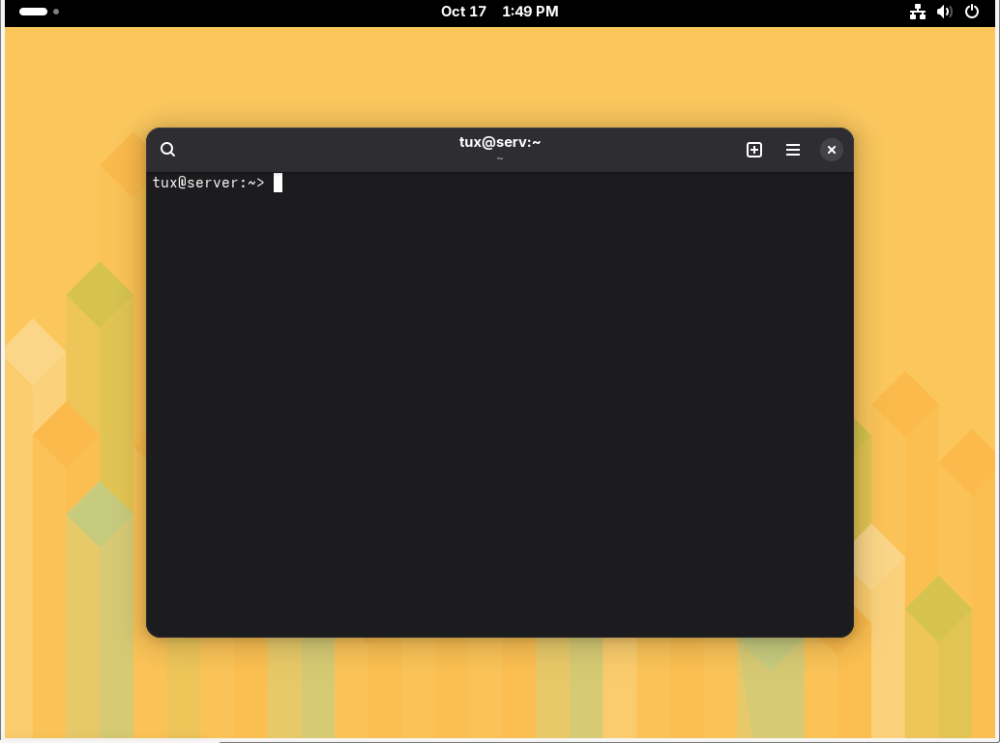

- **描述**: 顯示了 GNOME Console 終端機模擬器的介面，這是一個簡潔且現代化的命令列工具。
- **操作**: 使用者可以在此視窗中輸入 Linux 指令來與系統互動。

### 8-2-2. 遠端桌面 (Remote Desktop)

- **GNOME Remote Desktop**: 透過網路從其他電腦遠端連線到您的 GNOME 桌面環境。它使用 RDP 協定。
  - **安裝與設定**:
    - **`zypper`**: 安裝遠端桌面所需的套件。
      ```bash
      tux@suse16:~> sudo zypper in gnome-control-center gnome-remote-desktop
      ```
    - **`gnome-control-center`**: 開啟系統設定中的「分享」頁面來啟用它。
      ```bash
      tux@suse16:~> gnome-control-center system
      ```
    - **`firewall-cmd`**: 設定防火牆，允許 RDP 連線。
      ```bash
      tux@suse16:~> sudo firewall-cmd --permanent --add-service=rdp
      tux@suse16:~> sudo firewall-cmd --reload
      ```

#### 步驟 1: 進入系統設定的「分享」頁面

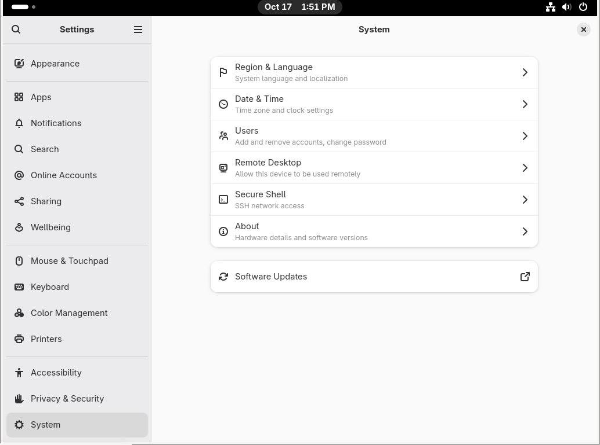

- **描述**: 這是 GNOME 控制中心的「分享」設定頁面。
- **操作**: 點擊頁面頂部的「關閉」開關來啟用分享功能，然後點擊「遠端桌面」選項進入詳細設定。

#### 步驟 2: 啟用遠端桌面

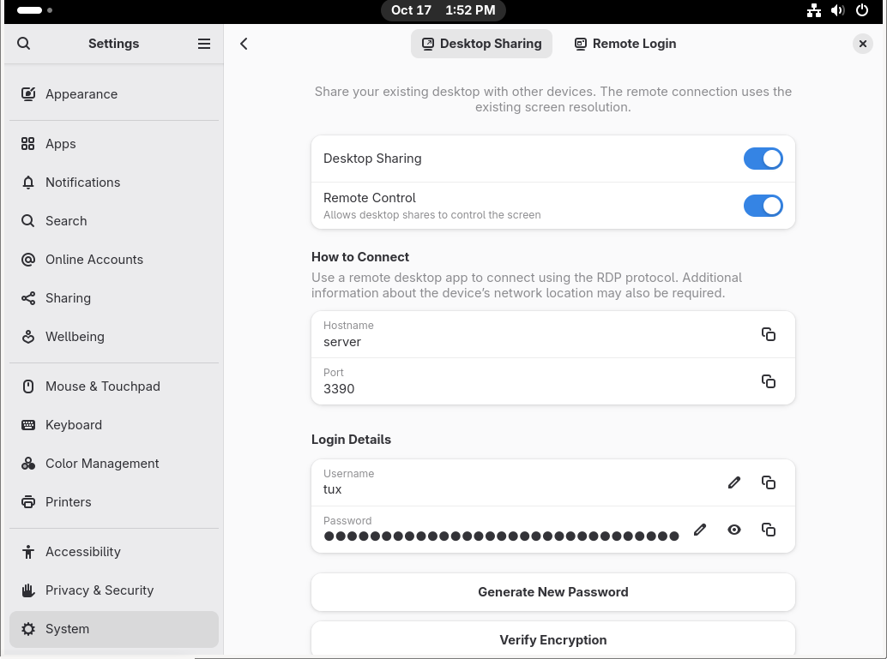

- **描述**: 這是「遠端桌面」的設定彈出視窗。
- **操作**: 點擊「遠端桌面」和「遠端控制」旁邊的開關以啟用它們。啟用後，系統會顯示用於連線的裝置名稱和認證資訊。

#### 步驟 3: 記下認證資訊

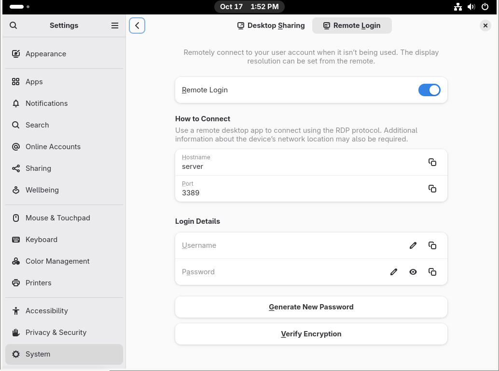

- **描述**: 啟用遠端桌面後，系統會提供一組使用者名稱和密碼。
- **操作**: 在遠端電腦上使用 RDP 客戶端軟體，並使用這裡顯示的「使用者名稱」和「密碼」來進行連線。

- **GNOME Connections**: GNOME 桌面內建的遠端連線客戶端工具，介面簡潔，專注於 RDP 和 VNC 協定。
  - **安裝**:
    ```bash
    tux@suse16:~> sudo zypper in gnome-connections
    ```
  - **啟動**:
    ```bash
    tux@suse16:~> gnome-connections
    ```

#### GNOME Connections 應用程式視窗

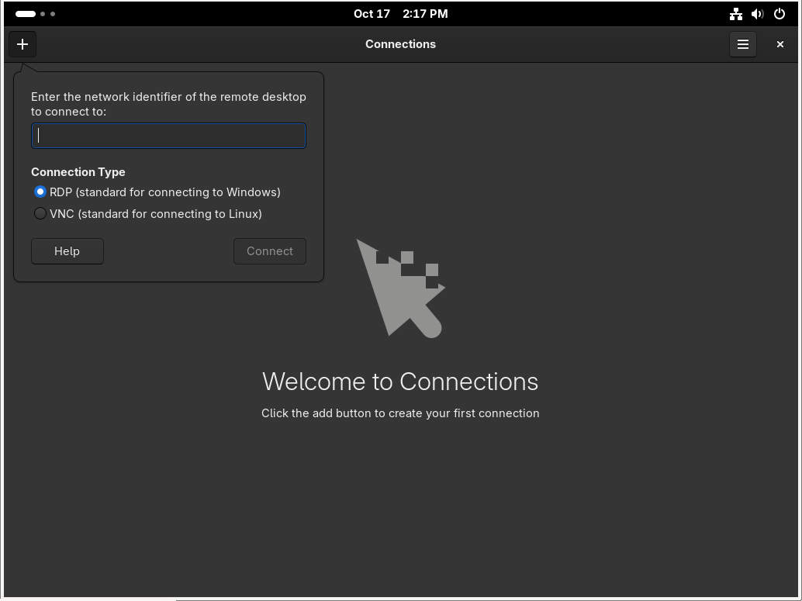

- **描述**: 顯示 GNOME Connections 應用程式的主畫面，介面簡潔，提示使用者新增第一個連線。
- **操作**: 點擊「+」按鈕來新增一個 RDP 或 VNC 遠端桌面連線。

- **Remmina**: 一個功能非常強大的遠端桌面客戶端，支援多種協定，包括 RDP (Windows 遠端桌面)、VNC、SPICE 和 SSH。
  - **安裝**:
    ```bash
    tux@suse16:~> sudo zypper in remmina
    ```
  - **啟動**:
    ```bash
    tux@suse16:~> remmina
    ```

#### Remmina 應用程式視窗

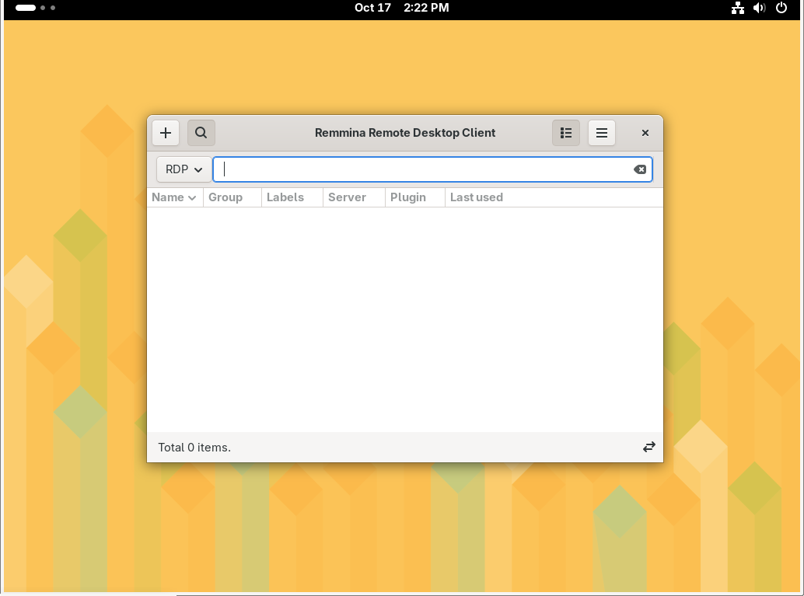

- **描述**: 這是 Remmina 的主視窗，它是一個功能豐富的遠端桌面客戶端。
- **操作**: 在上方的輸入框中選擇協定並輸入伺服器位址，或點擊左上角的「+」圖示來建立並儲存一個新的連線設定檔。

- **Vinagre**: 用於 GNOME 桌面環境的遠端桌面客戶端（Viewer），同樣支援 VNC、SPICE、RDP 和 SSH 等多種協定。
  - **安裝**:
    ```bash
    tux@suse16:~> sudo zypper in vinagre
    ```
  - **啟動**:
    ```bash
    tux@suse16:~> vinagre
    ```

#### Vinagre 應用程式視窗


- **描述**: 顯示 Vinagre 遠端桌面檢視器的主介面。
- **操作**: 點擊「連線」按鈕，然後在彈出視窗中選擇協定、輸入主機位址即可開始遠端連線。

### 8-2-3. 網頁瀏覽器 (Browser)

- **Firefox**: openSUSE 預設安裝的網頁瀏覽器，由 Mozilla 基金會開發，注重使用者隱私保護與開源標準。
  - **安裝**:
    ```bash
    tux@suse16:~> sudo zypper in MozillaFirefox
    ```
  - **啟動**:
    ```bash
    tux@suse16:~> firefox
    ```

#### Firefox 瀏覽器視窗

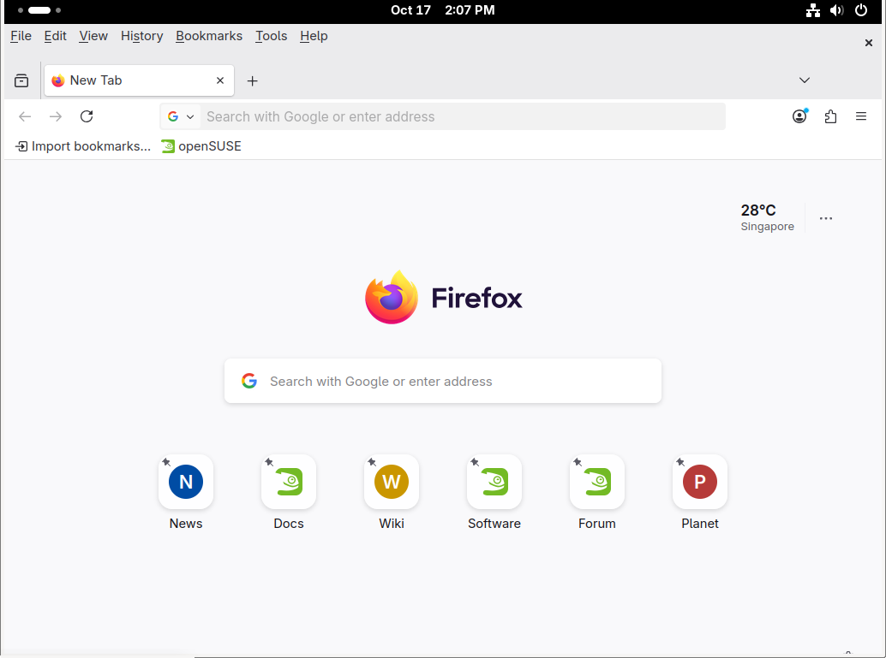

- **描述**: 顯示了 Mozilla Firefox 網頁瀏覽器的主畫面。
- **操作**: 在頂端的網址列輸入網址以瀏覽網頁。

- **Chromium**: Google Chrome 瀏覽器的開源版本，擁有龐大的擴充套件生態系，但不包含 Google 的專有編解碼器和服務。
  - **安裝**:
    ```bash
    tux@suse16:~> sudo zypper in chromium
    ```
  - **啟動**:
    ```bash
    tux@suse16:~> chromium
    ```

#### Chromium 瀏覽器視窗

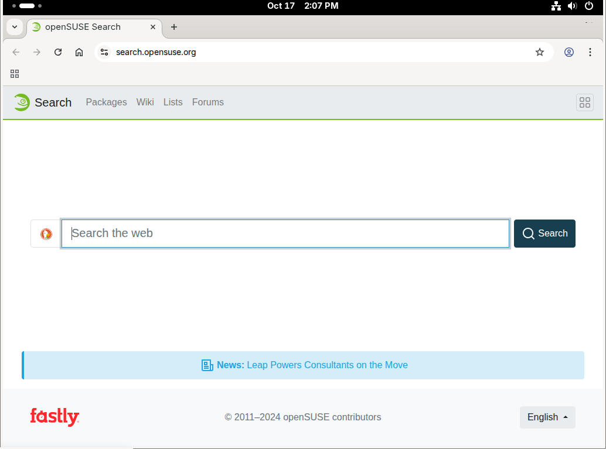

- **描述**: 顯示了 Chromium 網頁瀏覽器的主畫面，其介面與 Google Chrome 非常相似。
- **操作**: 在網址列輸入網址進行網頁瀏覽。

- **Google Chrome**: Google 官方發行的版本，包含所有功能和服務。
  - **安裝**:
    - **`wget`**: 下載 Google 的 GPG 金鑰。
      ```bash
      tux@suse16:~> wget https://dl.google.com/linux/linux_signing_key.pub
      ```
    - **`rpm`**: 匯入金鑰以驗證軟體來源。
      ```bash
      tux@suse16:~> sudo rpm --import linux_signing_key.pub
      ```
    - **`zypper`**: 新增 Google Chrome 的軟體源並進行安裝。
      ```bash
      tux@suse16:~> sudo zypper ar http://dl.google.com/linux/chrome/rpm/stable/x86_64 Google-Chrome
      tux@suse16:~> sudo zypper in google-chrome-stable
      ```
  - **啟動**:
    ```bash
    tux@suse16:~> google-chrome
    ```

### 8-2-4. Editor / 文字編輯器

- **GNOME Text Editor**: GNOME 預設的圖形化文字編輯器，取代了舊的 Gedit。介面簡潔，啟動迅速，適合日常的文字編輯工作。
  - **安裝**:
    ```bash
    tux@suse16:~> sudo zypper in gnome-text-editor
    ```
  - **啟動**:
    ```bash
    tux@suse16:~> gnome-text-editor
    ```

#### GNOME Text Editor 應用程式視窗

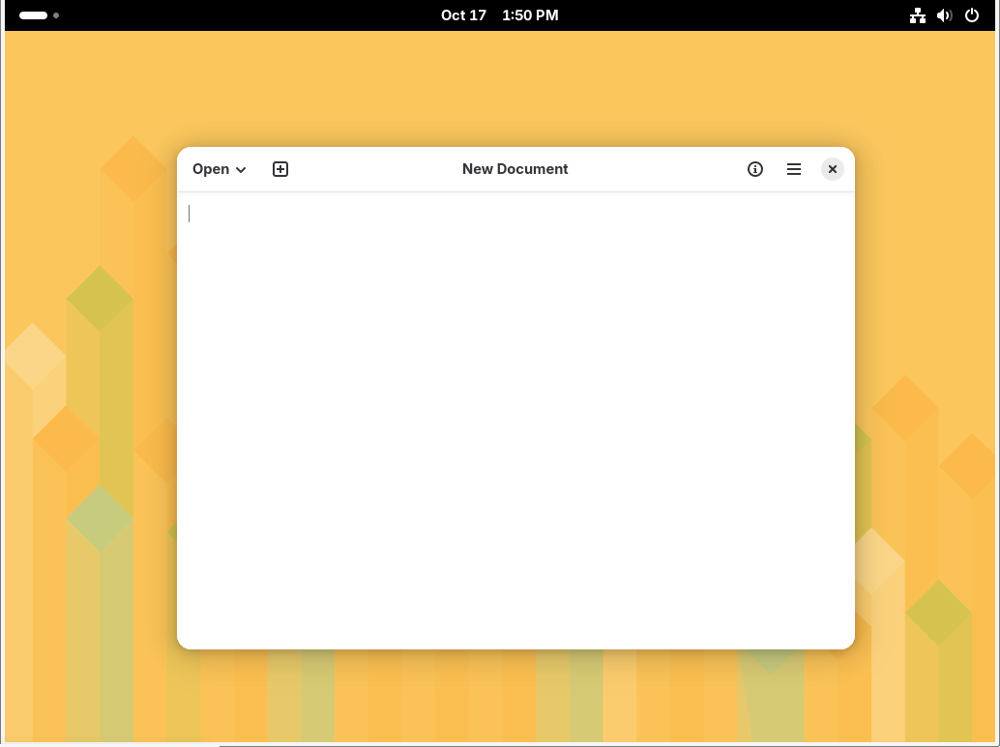

- **描述**: 顯示 GNOME 文字編輯器的介面，風格簡潔，專注於內容本身。
- **操作**: 直接在編輯區輸入文字，或透過右上角的選單按鈕開啟檔案、儲存檔案及調整設定。

- **Visual Studio Code (VS Code)**: 由微軟開發的現代化程式碼編輯器，憑藉其強大的功能、豐富的擴充套件和優異的性能，已成為開發者的首選工具之一。
  - **安裝**:
    - **`rpm`**: 匯入 Microsoft 的 GPG 金鑰。
      ```bash
      tux@suse16:~> sudo rpm --import https://packages.microsoft.com/keys/microsoft.asc
      ```
    - **`zypper`**: 新增 VS Code 的軟體源，刷新後進行安裝。
      ```bash
      tux@suse16:~> sudo zypper ar https://packages.microsoft.com/yumrepos/vscode vscode
      tux@suse16:~> sudo zypper ref
      tux@suse16:~> sudo zypper in code
      ```
  - **啟動**:
    ```bash
    tux@suse16:~> code
    ```

#### Visual Studio Code 應用程式視窗

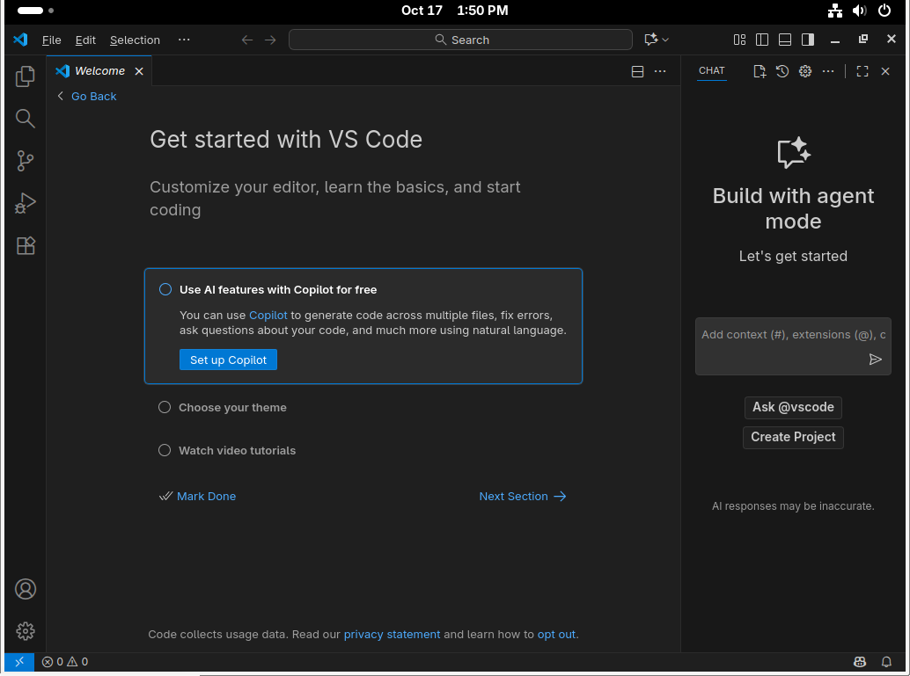

- **描述**: 顯示 Visual Studio Code 編輯器，這是一個功能強大的開發工具，左側為檔案總管，右側為程式碼編輯區。
- **操作**: 透過左側面板管理專案檔案，在右側編輯區撰寫程式碼，並可從左側的擴充套件市集安裝額外功能。

### 8-2-5. 中文字型與輸入法

為了在 Linux 中正確顯示和輸入中文，需要安裝對應的字型和輸入法框架。

- **中文字型 (Chinese Font)**:

  - **`zypper`**: 安裝所需的中文字型。
    - **安裝文泉驛字型**:
      ```bash
      tux@suse16:~> sudo zypper in wqy-bitmap-fonts wqy-zenhei-fonts
      ```
    - **安裝思源宋體 (繁體中文)**:
      ```bash
      tux@suse16:~> sudo zypper in adobe-sourcehanserif-tw-fonts
      ```
    - **安裝 Noto Sans (Google 的思源黑體) 繁體中文**:
      ```bash
      tux@suse16:~> sudo zypper in google-noto-sans-tc-fonts google-noto-sans-tc-mono-fonts
      ```
  - **`fc-cache`**: 更新系統的字型快取，讓新安裝的字型生效。
    ```bash
    tux@suse16:~> sudo fc-cache -f -v
    ```

- **輸入法框架 (Input Method)**:

  - **IBus (Intelligent Input Bus)**: GNOME 預設的輸入法框架，支援多種輸入法引擎。`ibus-chewing` 是其中一種常用的注音輸入法引擎。
  - **安裝**:

    ```bash
    tux@suse16:~> sudo zypper in ibus ibus-chewing

    tux@suse16:~> gnome-control-center keyboard
    ```

  - **設定**: 安裝後，通常需要在系統的「設定」->「鍵盤」->「輸入來源」中新增「中文 (Chewing)」即可開始使用。

  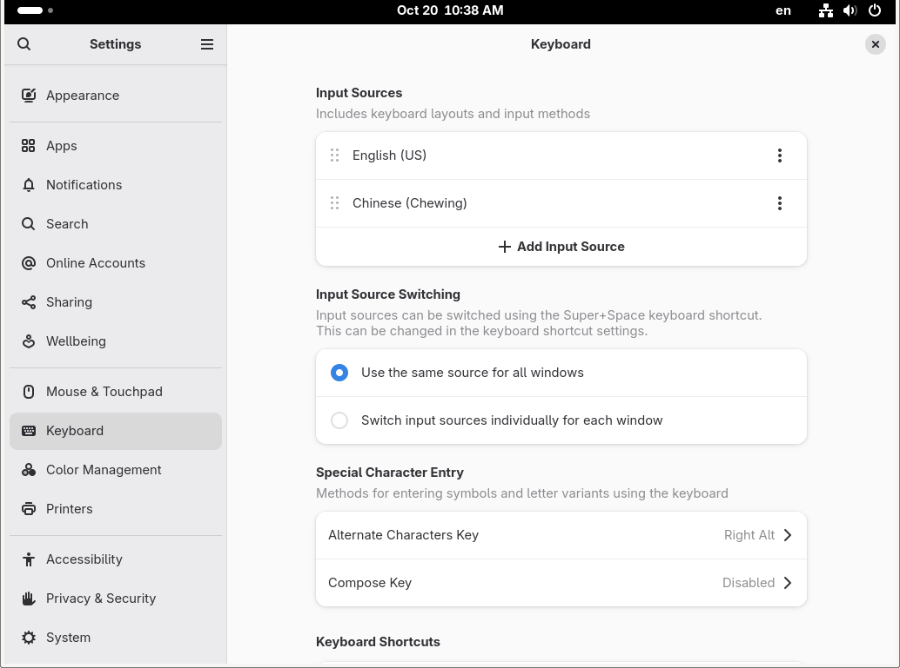

  - 描述: 此為 GNOME 桌面環境中的「鍵盤」設定畫面。主要用於管理不同的鍵盤佈局和輸入法（Input Sources）。
  - 操作:
    - Input Sources (輸入來源): 顯示目前已安裝的輸入法，如 "English (US)" 和 "Chinese (Chewing)"。使用者可以點擊 + Add Input Source 來新增更多語言的鍵盤佈局。
    - Input Source Switching (輸入來源切換): 提供了切換輸入法的設定。預設的切換快捷鍵是 Super + Space。使用者可以選擇讓所有視窗共用同一個輸入來源，或是為每個視窗單獨設定。
    - Special Character Entry (特殊字元輸入): 設定用來輸入特殊符號或字母變體的按鍵，例如設定 Compose Key。
    - Keyboard Shortcuts (鍵盤快捷鍵): 點擊此選項可以進入更詳細的鍵盤快捷鍵設定頁面。

- **GNOME Tweaks**: 一款進階設定工具，可以用來調整 GNOME 的隱藏選項，例如更換系統介面、文件和等寬字型。

  - **安裝與啟動**:

    ```bash
    tux@suse16:~> sudo zypper in gnome-tweaks

    tux@suse16:~> gnome-tweaks
    ```

    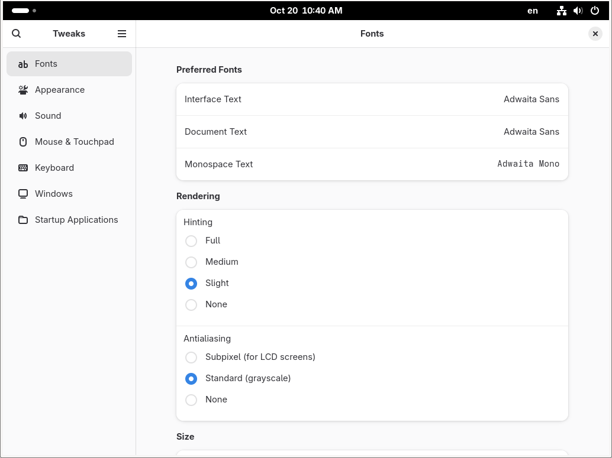

  - 描述: 此為 GNOME Tweaks (優化工具) 的主畫面，一個提供進階桌面自訂選項的工具。圖片中顯示的是「Fonts (字型)」設定分頁。
  - 操作:
    - Preferred Fonts (偏好字型): 可以分別為使用者介面 (Interface Text)、文件 (Document Text) 和終端機等使用的等寬字 (Monospace Text) 指定不同的字型。
    - Rendering (渲染): 提供了字型渲染的微調選項。
      - Hinting: 設定字型輪廓的對齊方式，以提高在低解析度螢幕上的可讀性。
      - Antialiasing: 設定字型邊緣的平滑處理方式，例如標準灰階或適用於 LCD 螢幕的子像素渲染。
    - 左側選單: 使用者可以切換到其他分頁，以調整外觀 (如主題、圖示)、視窗行為、開機啟動應用程式等。

### 8-2-6. Video Player / 影音播放器

- **VLC (VideoLAN Client)**: 享譽盛名的萬能播放器，以其無與倫比的格式相容性而聞名，幾乎可以播放任何影音檔案，無需額外安裝編解碼器。
  - **安裝**:
    ```bash
    tux@suse16:~> sudo zypper in vlc
    ```
  - **啟動**:
    ```bash
    tux@suse16:~> vlc
    ```

#### VLC 播放器視窗

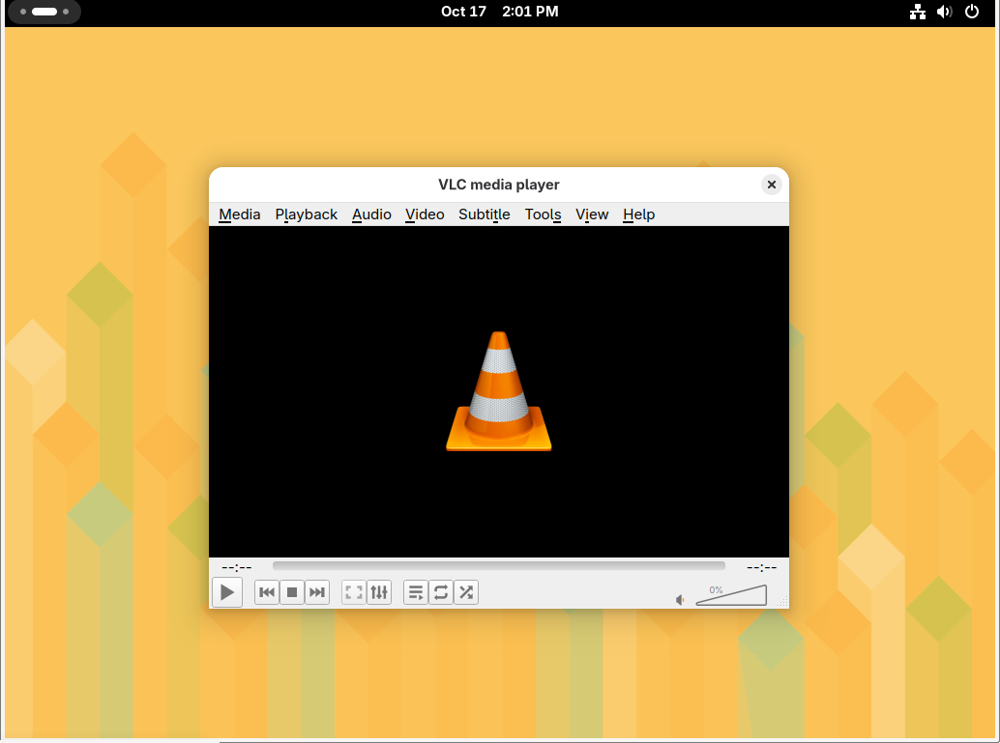

- **描述**: 顯示 VLC 媒體播放器的主介面，提示使用者可以將媒體檔案拖放到視窗中進行播放。
- **操作**: 透過「媒體」選單開啟檔案、光碟或網路串流，或直接將檔案拖入視窗。

### 8-2-7. 辦公室套件 (Office Suite)

- **LibreOffice**: 功能最完整的開源辦公室套件，是 Microsoft Office 的最佳替代品。它與 MS Office 格式高度相容，並包含 Writer (對應 Word)、Calc (對應 Excel)、Impress (對應 PowerPoint) 等多個元件。
  - **安裝**:
    ```bash
    tux@suse16:~> sudo zypper in libreoffice
    ```
  - **啟動**:
    ```bash
    tux@suse16:~> libreoffice
    ```

#### LibreOffice 啟動中心

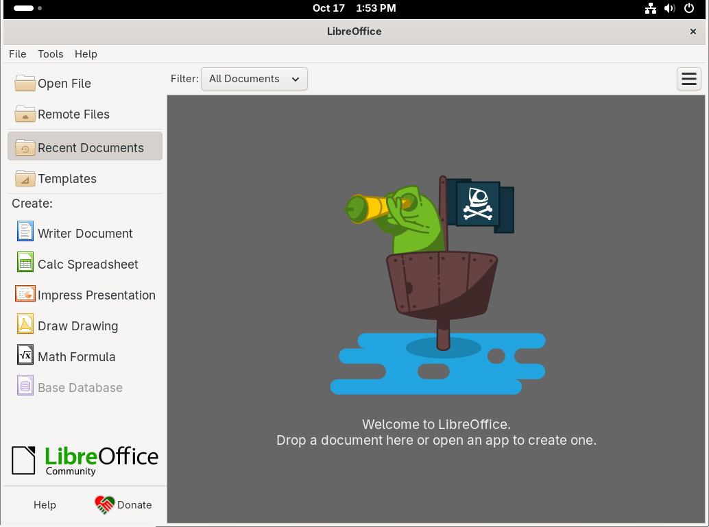

- **描述**: 這是 LibreOffice 的啟動中心，使用者可以從這裡建立或開啟不同類型的辦公文件。
- **操作**: 點擊左側的「建立」來新增 Writer 文件、Calc 試算表或 Impress 簡報等，或點擊「開啟檔案」來編輯現有文件。

### 8-2-8. 圖形影像 (Graphics)

- **GIMP (GNU Image Manipulation Program)**: 一款功能強大的點陣圖編輯軟體，被譽為「開源界的 Photoshop」，適用於相片修飾、影像合成和圖形創作。
  - **安裝**:
    ```bash
    tux@suse16:~> sudo zypper in gimp
    ```
  - **啟動**:
    ```bash
    tux@suse16:~> gimp
    ```

#### GIMP 應用程式視窗

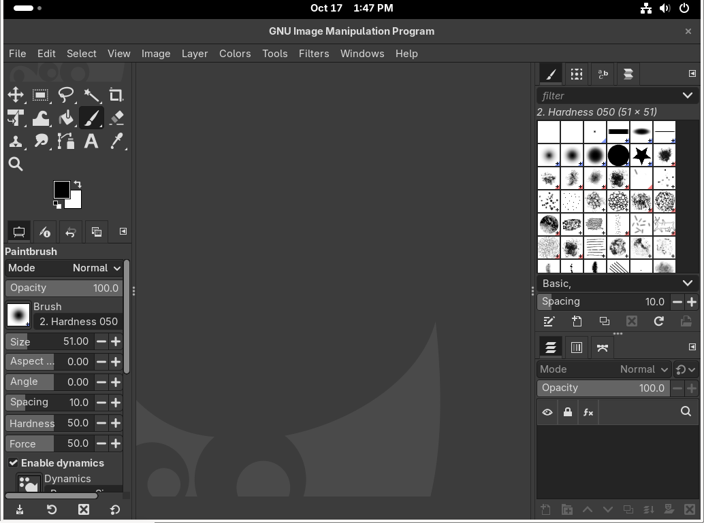

- **描述**: 顯示 GIMP 的主工作區，包含左側的工具箱、中間的畫布以及右側的圖層和筆刷面板，是一個專業的影像編輯環境。
- **操作**: 使用左側的工具對畫布上的影像進行編輯，並透過右側的面板管理圖層、色版和路徑。

- **Inkscape**: 一款專業的向量圖形編輯軟體，對標 Adobe Illustrator。使用標準的 SVG 格式，非常適合用於創作 Logo、圖示、技術圖表和藝術插畫。
  - **安裝**:
    ```bash
    tux@suse16:~> sudo zypper in inkscape
    ```
  - **啟動**:
    ```bash
    tux@suse16:~> inkscape
    ```

#### Inkscape 應用程式視窗

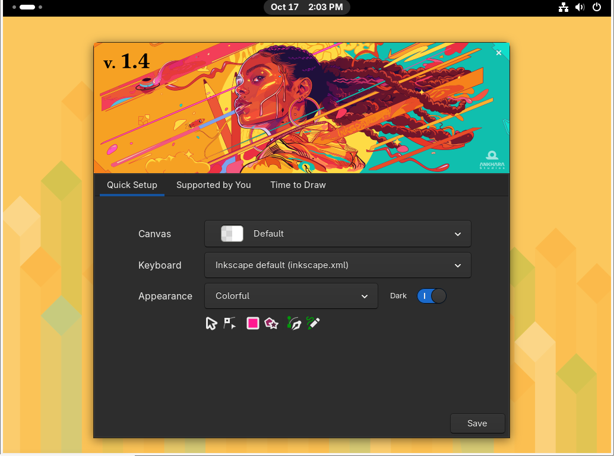

- **描述**: 顯示 Inkscape 向量圖形編輯器的歡迎畫面，提供快速建立新文件或從範本開始的選項。
- **操作**: 選擇畫布尺寸或直接點擊「時間來繪畫!」下方的「新文件」按鈕開始創作。

- **Krita**: 一款專為數位繪畫和 2D 動畫設計的點陣圖軟體，提供豐富的筆刷引擎、圖層管理和動畫工具，深受藝術家和插畫師的喜愛。
  - **安裝**:
    ```bash
    tux@suse16:~> sudo zypper in krita
    ```
  - **啟動**:
    ```bash
    tux@suse16:~> krita
    ```

#### Krita 應用程式視窗

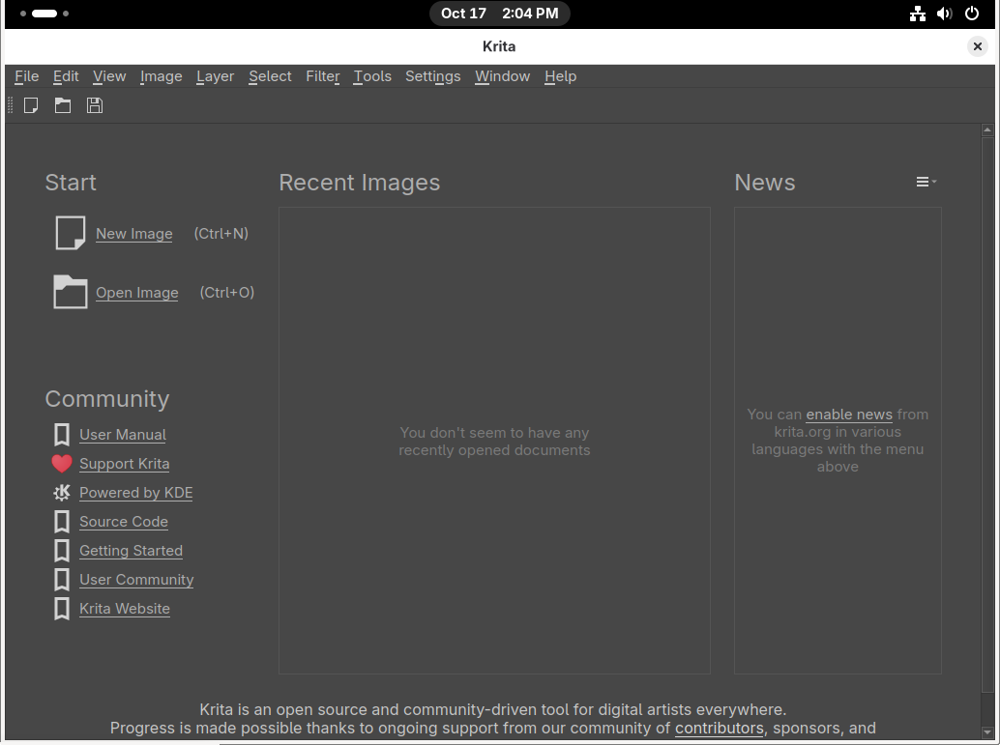

- **描述**: 這是 Krita 數位繪圖軟體的啟動畫面，右側顯示最近開啟的檔案，左側提供建立新檔案或開啟舊檔的選項。
- **操作**: 點擊「新增檔案」或「開啟檔案」開始繪畫，或從「社群」分頁獲取資源與教學。

### 練習

1.  **安裝應用程式**: 使用 `zypper` 一次性安裝 VLC 播放器、GIMP 和 Inkscape。
    ```bash
    tux@suse16:~> sudo zypper in vlc gimp inkscape
    ```
2.  **體驗新軟體**: 安裝完成後，從應用程式選單中找到並啟動它們，感受 Linux 桌面豐富的應用生態。
3.  **設定中文環境**: 依照本章節的說明，安裝至少一種中文字型和 `ibus-chewing` 輸入法，並在系統設定中啟用它，嘗試在文字編輯器中輸入中文。

---

## 8-3. 總結

本章介紹現代 Linux 圖形介面的各個層次。了解到，openSUSE 桌面是建立在更安全、更高效的 **Wayland** 顯示伺服器協定之上，徹底告別了傳統 X11 的歷史包袱。使用者所直接體驗到的外觀與操作流程，則是由 **GNOME** 或 **KDE Plasma** 這類功能豐富的 **桌面環境** 所提供。而負責驗證使用者身份並啟動這一切的，是像 **GDM** 或 **SDDM** 這類的 **顯示管理器**。更重要的是，看到 Linux 生態中涵蓋了各種用途的開源應用程式。從日常的網頁瀏覽 (Firefox)、文書處理 (LibreOffice)，到專業的程式開發 (VS Code)、影像編輯 (GIMP, Inkscape)，都有非常成熟且功能強大的免費軟體可供選擇。這充分證明了 Linux 桌面不僅僅是開發者和系統管理員的工具，也完全有能力成為一個功能完整、體驗現代化、安全可靠的日常作業系統。
